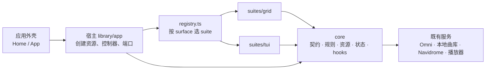

<!-- docs/library-suites.md：音乐库浏览的 headless core 与 UI suite 之间的关系，以及一套 UI 可以 / 建议实现的 core 能力。 -->

# 音乐库：core 与 UI suite

这份文档讲清楚两件事：

1. 音乐库浏览（首页、集合详情、歌手页）与在线账户（扫码登录、选平台、切换确认、登出）的代码怎么分成「core」和「UI suite」，它们之间怎么配合；
2. 想写一套新的 UI 时，core 提供了哪些能力、哪些建议实现、哪些可以不做。

代码都在 `src/library/` 下。目前提供默认的 `grid`，以及默认关闭、需显式启用的开发验证 suite `tui`。

## 一句话

**core 负责「数据和规则」，suite 负责「长什么样、怎么操作」。** core 说「这个歌单现在能删歌、能订阅」；suite 决定「删歌是点卡片上的红色按钮，还是按 Delete 键」。同一份数据、同一套规则，可以有任意多套 UI。

## 四个角色



| 角色 | 位置 | 做什么 | 不做什么 |
| --- | --- | --- | --- |
| core | `src/library/core/` | 定义能力；加载、缓存、分页；判定「此刻能不能做」；执行删歌、订阅等动作；保存筛选词、选中项、焦点；持有在线账户的扫码登录、待确认切换与登出流程 | 不知道任何 UI 长什么样，不 import 任何 suite 或组件 |
| suite | `src/library/suites/<id>/` | 把 core 的数据画出来，把按键 / 点击映射成 core 的动作；声明自己实现了哪些能力 | 不自己请求数据，不直接调 Omni / Navidrome / 本地曲库服务，不读账户 store，不 import 别的 suite |
| 宿主 | `src/library/app/` | 为当前打开的页面创建资源和控制器，接好播放、编辑等端口，挂载共用的对话框，通过 registry 渲染当前 suite；创建在线账户 controller（`useLibraryAccountController.ts`），接好切换清理端口（`createLibraryAccountPort.ts`），在首页外壳里按 suite 渲染账户界面（`LibraryAccountHost.tsx`） | 不画具体界面 |
| registry | `src/library/registry.ts` | 自动发现 `suites/*/entry.ts`；给定「哪个页面 + 用户选了哪套 suite」，返回该渲染的组件和它声明的动作 | — |

core 内部再分五层，依赖只能从上往下：

| 层 | 目录 | 内容 |
| --- | --- | --- |
| contracts | `core/contracts/` | 只有类型：能力清单、各页面的 props、资源快照、端口接口 |
| model | `core/model/` | 纯函数：筛选、条目身份、批量范围、能力判定、账户规则（选平台、可登出、登录文案） |
| services | `core/services/` | 资源（加载、分页、缓存、作废晚到结果）、动作控制器、账户 controller 与扫码登录会话 |
| state | `core/state/` | zustand store：浏览会话、目录会话、隐藏项、当前 suite |
| bindings | `core/bindings/` | React hooks：订阅资源、读写会话、拿到动作 |

这些依赖规则由 `test/unit/library/layerBoundaries.test.ts` 和 `dev/mcp/ts-code-map/codemap.mjs` 检查，违反会直接报错。

## 环境与依赖注入

契约、纯计算和资源 / 动作 controller 不依赖 React、组件、DOM 几何、CSS 或 framer-motion；React 生命周期与订阅在 `core/bindings/`，Zustand 状态在 `core/state/`。`core/contracts/suite.ts` 是宿主与视图之间的结构化装配协议：`Theme`、`isDaylight` 等展示输入不参与资源或 controller 的业务规则，组件类型也没有引入 React。

默认装配复用 Folia 现有环境服务。需要在其他运行环境中复用 controller 时，应注入对应依赖，而不是从 suite 直接访问这些服务；当前整个 `src/library/` 没有独立 npm 包、跨框架或服务端运行承诺。

| 默认装配入口 | 环境依赖 |
| --- | --- |
| `core/services/createCollectionResource.ts` | Omni、应用缓存 / IndexedDB、当前 Navidrome 账号与服务器作用域；本地集合接收宿主已解析的曲目 |
| `core/services/navidromeCollectionTracks.ts` | Navidrome 配置存储、Subsonic 请求、现有播放队列转换 |
| `core/services/collectionMutationDeps.ts` | Omni 变更、应用数据库的缓存失效 |
| `core/services/artistResourceDeps.ts` | Omni / Navidrome、本地封面与队列转换、翻译与等待端口 |
| `core/services/onlineHomeFeedDeps.ts` / `onlineHomeProvider.ts` | 当前 provider、账户与 feed、封面 metadata |
| `core/services/navidromeHomeLibraryDeps.ts` / `localDirectoryTreesDeps.ts` | 当前 Navidrome 配置与概览、本地导入根快照 |
| `app/createLibrary*Port.ts` / `useLibraryHomeResources.ts` | 播放与导航 store、导入导出、对话框、状态提示、收藏专辑刷新事件 |
| `core/services/providerAccountDeps.ts` | Omni 的扫码 auth（建码、轮询、取消、TTL、登录方式、诊断）与 provider 注册表、`useOnlineProviderAccountStore`（provider 列表与当前平台）、`useNeteaseApiStatusStore`（网易本地后端状态与重启）、window 定时器、`__APP_VERSION__` / `navigator` |
| `app/useLibraryAccountController.ts` / `createLibraryAccountPort.ts` | App 的 per-provider 账户刷新与登出；切换清理时的播放 store、播放器句柄、歌词、prefetch / track profile 运行态、搜索与集合导航 store |

`core/services/providerAccountController.ts` 与 `providerLoginSession.ts` 本身只经端口工作（auth、账户读写、刷新 / 登出、切换清理、网易后端、时钟、诊断环境），不 import Omni、store、`core/state` 或 React，分层测试检查这一点；单测注入假端口与手动时钟。账户真源仍是 `useOnlineProviderAccountStore`，controller 不建第二份账户状态。

## 兼容接口与迁移结束点

P5 收尾后，首页、集合与歌手业务的真源统一为 core 资源、会话与 controller。旧 libraryUi 目录和无消费者的业务转出已移除；新增 suite 不再从旧组件位置获取业务实现，也不增加第二套加载或缓存流程。

以下接口仍有应用消费者，保留在适配边界：

- `components/app/home/gridViewCollectionAdapters.ts` 将现有应用输入转换成 core 描述，并解析本地曲目、封面和排序；来源通用适配及 `GridView*` 类型别名继续供导航、搜索与播放器入口使用。
- `homeSurfaceTypes.ts` 的契约别名、grid 的 collection / artist surface 展示适配、命令面板的 Grid 命令 ID 映射继续使用；业务能力和操作范围仍由 core 判定。
- 收藏专辑刷新事件、旧浏览恢复记录的读取 / 单向迁移、隐藏歌单的存储 key 和格式保留。布局记录属于各 suite，显式完成页面时由宿主统一清除。刷新后恢复打开的集合仍不在本次范围内。

资源 registry 有界保留已释放资源并回收孤立实例；suite resolver 按实际解析的 suite、surface 与回退状态共享结果，未知或当前构建禁用的 ID 不再扩张缓存。未知 ID 仍沿用默认 suite 的现有解析标记；已注册 suite 缺少某 surface 时 `isFallback` 为 true。

在线曲目缓存沿用 main 的 schema 7，保留原始 `nextOffset`、`hasMore` 与 `total`。混合分页的可见歌曲数可能少于上游位置，不能按行数恢复；旧快照缺少安全游标时重新读取，已完成快照也不按集合估计总数继续补页。日推卡片由首页 feed 的 provider 能力决定，空结果与不支持分别表达。

## 一次「打开歌单并删一首歌」是怎么走的

1. 用户在首页点开一个歌单。首页只调用 `onOpenGridView(歌单描述)`，导航 store 记下「现在打开的是它」。
2. 宿主看到导航变化：为这个歌单拿到一份**资源**（负责加载曲目）和一个**变更控制器**（负责删歌、订阅等）。宿主自己不订阅它们。
3. 宿主问 registry：「`collection` 页面，用户选的是 tui，该用谁？」registry 返回 TUI 的集合组件，以及 TUI 声明的动作清单。
4. TUI 组件订阅资源，拿到曲目，画成列表。
5. 用户按 Delete。TUI 调 `mutations.removeEntry({ entryKey, track })`。
6. 控制器先问 core 的规则「这个歌单能删歌吗」，再调上游接口；上游确认后，更新资源。
7. 资源一更新，**所有订阅它的 UI 同时看到**。如果这时切回网格，网格拿到的是同一份资源：不重新请求，筛选词和焦点也还在（它们在浏览会话里，不在组件里）。

网格删歌时有 460ms 的卡片退出动画。动画是网格自己的事：它在展示层「按住」旧的一帧，动画放完再显示已提交的数据。core 不等动画，TUI 也不受影响。

## 能力是怎么定义的

core 把能力分成两级：

- **surface（页面）**：`home`（首页与目录）、`collection`（集合详情）、`artist`（歌手页），以及叠在首页之上的 `account`（登录框与切换确认，见「账户」一节）。
- **动作**：每个 surface 上的语义动作，例如集合页的 `play-scope`（播放当前筛选范围）、`remove-entry`（删掉一个条目）。

一个动作最终出现在 UI 和命令面板里，要同时满足两条：

| 条件 | 谁说了算 | 例子 |
| --- | --- | --- |
| core 判定「这个对象此刻能做」 | core 的规则（`core/model/*Capabilities`、`*Surface`） | 别人的歌单不能删歌；加载中不能重新拉取 |
| suite 声明「我的 UI 做这件事」 | suite 的 `entry.ts` | TUI 没有歌单选择器，所以不声明 `add-to-playlist` |

**没实现的 surface 会回退到默认 suite（grid）**：某套 suite 没有歌手页，打开歌手时就由网格渲染，用户照样能用。**没声明的动作**则既不出现在这套 UI 上，也不出现在命令面板里，避免「面板里有、界面上却做不到」。

suite 还可以有自己的「局部动作」（`extraActions`），它们不属于 core。例如网格的「开关信息面板」「开关曲目侧栏」「编辑模式」。

## 宿主交给每个页面的东西

不管是哪套 suite，同一个页面拿到的输入完全一样（类型在 `core/contracts/suite.ts`）：

| 页面 | 主要输入 |
| --- | --- |
| collection | `collection`（描述）、`resource`（曲目资源）、`mutations`（变更控制器）、`playback`（播放端口）、导航（`onBack` / `onDone` / `onOpenAlbum` / `onOpenArtist`）、`declaredActions`、`isInteractive` |
| artist | `collection`、`resource`（歌手资源：详情、热门歌曲、专辑）、`playback`、导航（同上）、`onEditEntity`、`declaredActions`、`isInteractive` |
| home | 首页数据（歌单、本地曲库……）、`account`（在线账户 controller：provider 列表、当前平台、选平台、登出）、可选的 `accountLayerRef`（账户层挂载点）、`homeResources`（收藏专辑、电台 feed、首页动作、Navidrome 概览、文件夹树）、`directoryActions`（目录批量动作）、`onOpenGridView`、`declaredActions`、`isInteractive` |
| account | `account`（同一个 controller）、`layer`（首页 surface 交上来的账户层）、`theme`、`isDaylight`、`declaredActions`（账户动作）、`isInteractive`（首页外壳层的值） |

`isInteractive` 为 false 时（例如另一层盖在上面、或正在退场），页面不要接键盘、不要往命令面板注册。

## 返回：「完成」与「离开」

同一个手势在每套 suite 里含义相同，执行在宿主（`src/library/app/GridViewOverlayHost.tsx`），suite 只按手势选一个回调：

| 手势 | 回调 | 含义 | 宿主做什么 |
| --- | --- | --- | --- |
| 显式的返回按钮 | `onDone` | 看完了 | 清掉这一层的浏览会话（筛选、焦点）；让**每一套** suite 忘掉这一层的布局记录（manifest 的 `layout.forget`，网格丢掉 `folia_gridview_state:v2:` / `folia_artist_grid_state:v2:` 两份记录）；再返回 |
| Escape 阶梯的最后一步 | `onBack` | 离开但保留 | 只返回 |
| 浏览器后退 | —（不经过 suite） | 离开但保留 | popstate 弹栈之前由导航 store 通知（`subscribeCollectionPop`），宿主让渲染这一层的 suite 跑 `transitions.beforeBack` |

要点：

- 两条返回路径都只跑一次 `beforeBack`：应用内返回先跑，再走 `history.back()`；随后的弹栈通知认出这是同一次弹栈，不再跑。浏览器后退时 `beforeBack` 也是在界面与导航 store 都还没变的时候运行，网格的反向移形换影与卡片散开和点返回按钮一样出现。
- 「完成」先清会话再返回。离开的那一层卸载时如果还想把焦点写回（TUI 会），要先比较会话的「代」（`getLibrarySessionGeneration`）：挂载以来被清过就不写，否则会把刚清掉的会话又写出来。
- 布局记录不在 core 里，但「忘掉」要由宿主统一发起：在 TUI 里看完的集合，下次在网格里打开也应该从头开始。有布局记录的 suite 在 entry 里给 `layout: { forget(sessionKey) }`。

## 转场与背景板

集合和歌手页的转场由实际渲染该 surface 的 suite 提供，包括回退到默认网格的情况。宿主不读取网格的动效设置，也不保存网格专属时长。

`transitions.backdrop` 是可选的订阅接口（类型在 `core/contracts/suite.ts`）：

- `getSnapshot()` 返回稳定的快照：`enabled`、`enter`，以及可选的 `exit`。`enter` / `exit` 包含以秒计的 `duration` 和四点贝塞尔曲线 `ease`；没有 `exit` 时退场沿用 `enter`。
- `subscribe(listener)` 返回退订函数。suite 自己解析设置，只有最终快照变化时通知；宿主通过 `app/useLibraryBackdrop` 订阅，切 suite 时自动换订阅。
- `enabled` 控制这套 suite 的 `beforePush` / `beforeBack` 与 `Overlay`。没有声明背景板时使用 0.18 秒的中性淡入淡出，并保留该 suite 已声明的转场钩子；服务端渲染也使用中性快照。

网格在 `suites/grid/transitions/gridBackdrop.ts` 解析「降低动态效果」的 `collectionMorph` 设置：正常入场 0.62 秒、退场 0.28 秒；降低动效时使用 0.18 秒中性背景板，并关闭移形换影。TUI 没有声明转场，使用中性背景板。应用内返回与浏览器后退仍走同一套 `beforeBack`，一次返回只调用一次。

## 常驻舞台（stage）

有的 suite 不是「首页一张图、集合层盖一张图」，而是一块横跨首页与集合层的画面（bravais 的整面墙：换层时墙上的磁贴原地翻牌，不能因为换 surface 而重挂）。这种 suite 在 manifest 上声明可选的 `stage`（类型 `LibrarySuiteStageProps`，在 `core/contracts/suite.ts`）：

- **输入**：`isInteractive`（首页外壳层的值，集合层打开时仍为真；上面盖了别的层时为假）、`theme`、`isDaylight`、`navigation`（集合导航快照：`depth` / `origin` / `activeType`，首页时 `depth` 为 0）。
- **分工**：stage 负责画面；这套 suite 的首页 / 集合 / 歌手 surface 不画画面，只把自己的数据投影成层描述交给 suite 内部的 store，并照常注册命令面板。
- **宿主怎么挂**：`GridViewOverlayHost` 经 `registry.resolveLibraryStage(store 的 suite)` 只挂**生效 suite** 的 stage（未知 id 生效的是 grid，grid 与 TUI 都没有 stage），位置在首页容器之后、中性背景板与集合层之前，包 `Suspense`（fallback 为 null）。打开 / 关闭集合只换 props，不重挂；换 suite 时卸载（换成另一套带 stage 的 suite 时重挂）。首页外壳整个卸载时（播放页全屏约 350ms 后 `Home` 返回 null）stage 也卸载，跨卸载要保留的布局放进 sessionStorage 或 store，并在 `layout.forget` 里能丢掉。
- **背景板与首页**：渲染当前层（集合或歌手页）的 suite 正是挂着 stage 的那套时，宿主不渲染中性背景板，首页容器也不加 `visibility: hidden`（`aria-hidden` 与 `pointer-events: none` 照旧）；当前层回退到 grid 时与没有 stage 一样。规则是 `core/model/libraryStage.ts` 的 `resolveLibraryLayerPresentation`。
- **和 `transitions.Overlay` 的区别**：Overlay 是**每一套** suite 都常驻挂载的转场层，只拿到 `enabled`，`enabled=false`（降低动效、或当前层不归它）表示「不做转场」，承载不了常驻画面；stage 只在这套 suite 生效时挂载，是画面本身。网格的移形换影继续用 Overlay；有 stage 的 suite 一般不需要 Overlay。
- **按需加载**：非默认 suite 的 stage 必须是 `React.lazy`（`test/unit/library/suiteEntries.test.ts` 按源码检查），没选它的用户不加载它的 chunk。

## 外观动作（suite-chrome）

suite 自己的外观操作（bravais 的缝等级、打开面板、定位正在播放）不是 core 的资料动作，挂不到任何 surface 上，又不该占全局快捷键。它们走命令面板的 `suite-chrome` 作用范围（B2）。

- **什么时候用**：只属于这套 UI 的呈现操作，别的 suite 没有对应物。core 的资料动作（播放、筛选、排序、删歌……）照旧走 grid / directory / artist surface；网格的三个局部动作（信息面板、曲目侧栏、编辑模式）仍是 grid surface 的 `extraActions`，不改造。
- **manifest 声明**（静态，命令契约测试能枚举）：`chromeActions: [{ id, title, description, keywords, executeShortcut? }]`，类型 `LibrarySuiteChromeActionMeta`（`core/contracts/suiteChrome.ts`）。`id` 是 suite 内唯一的小写 kebab-case；`title` / `description` 只是缺译时的英文回退，正式文案写在 en / zh-CN / in 三份 locale 的 `commandPalette.commands.<命令 id>`（与其它命令同一约定，契约测试缺一份就红）。`keywords` 写英文与中文，不手写拼音、ASCII 关键词不照抄标题；拼音由构建期插件从中文生成，它只扫 `suites/<id>/entry.ts` 与同目录的 `chromeActions.ts`，所以声明只能放在这两种文件里。建索引时校验 id 格式、重复与空文案（`core/model/suiteChrome.ts`）。
- **运行时注册**：suite 用 `useLibrarySuiteChromeRegistration({ suiteId, isInteractive, handlers })`（`core/bindings`），`handlers` 是「动作 id → `{ isAvailable(): boolean; run(): void }`」，每次渲染可以给新对象（latest-ref，不重注册）。`isInteractive` 为假或组件卸载（换 suite）时注销；旧实例晚一步卸载不会清掉接手的新实例。store 是 `core/state/useLibrarySuiteChromeStore`，命令面板经 `useCommandPaletteContext` 的 `scope.chrome` 读它。动作只描述做什么，不碰 DOM。
- **命令 id 与可用性**：命令 id 为 `<suiteId>-<动作 id>`（`libraryChromeCommandId`），由 `createSuiteChromeCommand` 生成，group 为 `grid`。可用要同时满足：当前视图是首页（`suite-chrome` 作用范围要求 `view === 'home'`）、注册着的正是这套 suite、它给了这条动作的实现且 `isAvailable()` 为真。执行时再问一次 `isAvailable()` 才调 `run()`。
- **怎么进命令列表**：命令文件不 import registry（会把默认 suite 的整套组件拉进命令面板的模块图），所以命令不是静态声明的：`library/app/installLibrarySuiteChromeCommands` 在 bootstrap 渲染前（只在主窗口）用 registry 的可用 suite 生成命令，经 `commandRegistry.setSuiteChromeCommands` 装进列表（重复调用替换上一批）。契约测试与拼音覆盖测试用同一个 `buildSuiteChromeCommands(listLibrarySuites())` 自己生成并检查。
- **执行键**：给不给 `executeShortcut` 的判断与其它命令相同（危险、不可撤销、要确认的不给）。装入时对整张列表做无前缀冲突检查，冲突直接抛错（启动即暴露）。`suite-chrome` 只在首页视图成立，与 `lattice`（Lattice 视图）、`player-surface`（播放页）互斥，可以复用它们的键（例如 Lattice「聚焦当前歌曲」的 `c`）；不同 suite 的外观动作同一时刻只有一套可用，彼此也可以同键。与全局命令（`n` 下一首、`l` 循环……）和同时可能出现的 grid / directory / artist surface 命令必须无前缀冲突。

## 页面教程（Ponder）

页面教程跟实际渲染的页面走，按可见的 `data-ponder-page-scope` 解析。网格首页、集合 / 歌手页和目录保留各自的教程标记；TUI 的 `home` / `collection` / `artist` 都显式声明 `data-ponder-page-scope="none"`，表示当前页面没有教程。某套 suite 回退到网格时，由网格页面的标记提供教程。

显式的 `none` 与没有标记不同：`none` 返回空目标；缺失或未知标记仍按主视图回退。隐藏或尺寸为零的标记不参与解析；设置、帮助等上层页面可覆盖底下的页面，首次使用引导优先打开总览。

`services/ponder/pagePonderTarget.ts` 的 `readCurrentPagePonderTarget()` 统一读取当前目标；它与 `resolvePagePonderTarget()`、`openCurrentPagePonder()` 都可能返回 `null`。空目标时，长按 Ctrl+G 不显示提示、不预热教程层、不启动计时，触屏和命令入口也不创建教程 session。新 suite 没有对应教程时，应显式声明 `none`，避免继承主视图的教程。

## 能力清单：哪些建议实现

分级的意思：

- **基础**：不做的话，这套 UI 在这个页面基本没法用。
- **推荐**：常用；做起来不难，core 已经把规则和动作都备好了。
- **可选**：低频，或者需要额外的交互（输入框、确认框、选择器）。不做也没关系，用户可以切回网格完成。

### 集合详情（`collection`）

建议**第一个**实现的页面：它是浏览的核心。

| 动作 | 是什么 | 分级 | 用到的 core |
| --- | --- | --- | --- |
| `play` | 播放某一首（队列 = 当前筛选范围） | 基础 | `useCollectionActions().playTrack` |
| `enqueue` | 某一首加入队列 | 基础 | `.enqueueTrack` |
| `play-scope` | 播放当前筛选范围 | 基础 | `.playScope` |
| `enqueue-scope` | 当前筛选范围加入队列 | 基础 | `.enqueueScope` |
| `filter` | 按关键词筛选 | 基础 | `useLibrarySessionQuery` + 命令面板筛选框（`useGridCommandFilter`） |
| `reload` | 跳过缓存重新拉取在线集合 | 推荐 | `.reload`，能力 `capabilities.reload` |
| `resume-sync` | 后台补页中断后续传 | 推荐 | `.resumeSync`；快照的 `sync.status === 'interrupted'` |
| `remove-entry` | 删一首（每日推荐里是「不喜欢」） | 推荐 | `mutations.removeEntry`；能力 `capabilities.removeEntry` |
| `subscribe` | 收藏 / 取消收藏歌单或专辑 | 推荐 | `mutations.toggleSubscribe`；快照 `subscribed` / `subscribing` |
| `sort` | 本地文件夹排序 | 推荐（有本地曲库时） | `useLocalTrackSortStore` |
| `rename` | 改名（本地 / Navidrome 歌单） | 可选，需要输入框 | `mutations.rename` |
| `delete-collection` | 删除歌单 / 文件夹 | 可选，需要确认 | `mutations.deleteCollection` |
| `resync-folder` / `resync-all-folders` | 重新扫描文件夹 | 可选 | `mutations.resyncFolder` / `resyncAllFolders` |
| `export-playlist` | 导出本地歌单 | 可选 | `mutations.exportPlaylist` |
| `edit-entity` / `organize-song-info` / `match-song` | 打开宿主的编辑 / 整理 / 匹配对话框 | 可选，几乎零成本（对话框由宿主提供） | `mutations.editEntity` / `organizeSongInfo` / `matchSong` |
| `daily-date` | 切换每日推荐的历史日期 | 可选 | `mutations.setDailyDate` |
| `add-to-playlist` / `create-playlist` | 加入 / 新建 Navidrome 歌单 | 可选，需要歌单选择器 | `mutations.addToPlaylist` / `createPlaylist` |
| `open-album` / `open-artist` | 打开曲目上的专辑 / 歌手（嵌套压栈） | 推荐 | `resolveTrackAlbumLink` / `resolveTrackArtistLinks`（`core/model/trackLinks`，在线曲目注入 `canResolveSongCatalogRef`）→ `onOpenAlbum` / `onOpenArtist` |

此外建议：

- 显示加载中、错误（`snapshot.error`，不要和「歌单本来就是空的」混在一起）、后台补页进度与中断。
- 动作结果是判别式（`ok`，或 `busy` / `stale` / `limit-reached` / `failed` …），文案由 UI 自己翻译。重复提交时控制器会返回 `busy`，UI 不需要自己防抖。
- 打开嵌套的专辑 / 歌手之前，把焦点写回浏览会话（`setFocusedEntry`）；离开（卸载、换 suite 的冲刷）时也写，但只在用户在这里动过焦点时写——没动过就写，会把会话里别处记下的焦点盖成第一行。返回时按会话里的条目键恢复焦点。

### 首页与目录（`home`）

推荐实现：让这套 UI 从首页就能开始浏览。不实现时首页由网格渲染，用户从网格点开集合后照样进入你的集合页。

页面本身（不是动作）要做的：来源与分区页签、条目列表、打开条目（`homeResources.actions.openOnlineCard` / `openLocalGroup` / `openNavidromeCard`）。core 的 hooks 是 `useLibraryHomeSources`、`useLibraryHomeOnline`、`useLibraryHomeLocal`、`useLibraryHomeNavidrome`、`useLibraryHomeDirectory`。

| 动作 | 是什么 | 分级 | 用到的 core |
| --- | --- | --- | --- |
| `directory-filter` | 筛选目录条目 | 基础 | `useLibraryDirectoryQuery` |
| `directory-select` | 批量选择（全选 / 清空 / 逐个） | 推荐 | `useLibraryDirectorySelection` |
| `directory-play-selection` / `directory-enqueue-selection` | 播放 / 入队选中的 | 推荐 | `useLibraryDirectoryActions`、`runDirectoryBatchAction` |
| `directory-manage-hidden` / `directory-toggle-hidden` | 管理隐藏的歌单 | 推荐 | `useLibraryDirectoryVisibility`、`useHiddenCollections` |
| `directory-create-playlist` | 用选中的歌新建本地歌单 | 可选，需要输入框 | 同上 |
| `directory-remove-selection` | 从曲库删除选中的 | 可选，需要确认 | 同上 |
| `directory-rescan-root` / `directory-remove-root` / `directory-clear-ignore` | 导入根的重扫、移除，恢复被忽略的文件夹 | 可选 | 同上 |
| `home-import-folder` / `home-refresh-folders` / `home-import-playlist` | 导入文件夹、刷新、导入歌单文件 | 可选 | `useLibraryHomeActions` |
| `home-refresh-navidrome` | 刷新 Navidrome 概览 | 可选 | `useLibraryHomeNavidrome().refresh` |

隐藏项的规则由 core 统一：只有「歌单类」条目能隐藏；隐藏按来源分作用域；隐藏的条目不出现在浏览、筛选和任何批量范围里，只在「管理隐藏」视图里能看到。UI 只负责显示和切换。

在线账户的平台列表（选平台、登出）也在首页上，但它的动作声明在 account surface 里，见下面「账户」一节。

### 歌手页（`artist`）

可选：不实现时自动由网格渲染。

| 动作 | 是什么 | 分级 | 用到的 core |
| --- | --- | --- | --- |
| `play` / `enqueue` | 播放 / 入队某首热门歌曲 | 基础 | `playback` 端口；歌手资源的 `topSongs` |
| `open-album` | 打开歌手的某张专辑 | 基础 | `artistAlbumLink(album, collection)` → `onOpenAlbum` |
| `filter` | 按名字筛选专辑 | 推荐 | `useLibrarySessionQuery` |
| `play-scope` / `enqueue-scope` | 播放全部热门歌曲 / 整批加入队列 | 推荐 | `playback.enqueueAll(tracks, { suppressToast: true })` 返回实际收下的条数 |
| `open-artist` | 打开歌曲上的其他歌手 | 推荐 | `onOpenArtist` |
| `reload` / `resume-sync` | 加载失败时重试、专辑分页中断时续页 | 推荐 | `resource.reload()` / `resource.retryAlbums()` |
| `edit-entity` | 编辑本地歌手实体 | 可选 | `onEditEntity`（对话框由宿主提供） |

歌手资源的状态：`idle` / `loading` 显示加载中；`ready` 但没有 `detail` 是空态；`error` 显示加载失败。

## 账户：登录、选择与切换确认

在线账户的全部流程在 core 的账户 controller 里（`core/services/providerAccountController.ts`，契约 `core/contracts/account.ts`，纯规则 `core/model/accountRules.ts`）：扫码登录状态机、选平台规则、待确认切换、登出。每套 suite 只画自己的平台列表、登录界面和确认界面，经同一个 controller 驱动。

### controller 的快照与动作

App 创建一个 controller（`app/useLibraryAccountController.ts`，App 卸载时 `dispose`），经首页 props 的 `account` 交给 home surface，经 account surface 的 `account` 交给登录与确认界面，也交给播放器面板的 AccountTab。suite 只订阅、调动作，不创建也不销毁。

快照（`getSnapshot` / `subscribe`，没有变化时保持身份）：

| 字段 | 内容 |
| --- | --- |
| `providers` / `activeProviderId` | provider 列表 × 账户 store；当前平台已回落（存的平台不在列表里时是 netease） |
| `login` | 当前登录会话，同一时间最多一个：`phase`（`resolving-methods` / `choosing-method` / `loading` / `waiting` / `scanned` / `confirmed` / `expired` / `error`）、`methods` 与 `selectedMethodId`、`qrImageUrl`、`failure`、`backend`（网易本地后端故障与重启）、`copy`（i18n key） |
| `pendingSwitch` | 待确认切换 `{ id, from, to, reason }`，`reason` 是 `switch` 或 `activate-after-login` |
| `logout` | 登出进度，同一时间最多一个在途 |
| `lastLoginCompletion` | 最近一次扫码确认的结局（`completed` / `refresh-failed` / `activation-declined`） |

动作全部返回判别式结果，文案由 UI 翻译（绑定 `core/bindings/useLibraryAccount.ts` 的 `useLibraryAccountLogin` / `useLibraryAccountPendingSwitch` / `useLibraryAccountProviders` 给出翻译好的视图）：

| 动作 | 语义 | 结果 |
| --- | --- | --- |
| `selectProvider(id)` | 选平台：未配置或不在列表 → 不可用；能直接切（已登录 / 无需登录）→ `requestSwitch`；否则 `startLogin` | `unavailable` / `switch` / `login`，后两支带各自的结果 |
| `requestSwitch(id)` | 同平台直接 `switched`（`changed: false`）；否则生成 `pendingSwitch` 等用户答复，已有的待确认请求按 `declined`（`superseded`）结算 | 用户答复后才 resolve：`switched` / `declined`（`cancelled` / `superseded` / `disposed`）/ `unavailable` |
| `confirmSwitch(requestId)` / `cancelSwitch(requestId)` | 按请求 id 结算 | `confirmed` / `cancelled`；过期的 id 返回 `stale` |
| `startLogin(id)` | 先停掉旧会话；解析登录方式（带竞态代次），单方式直接要码，多方式停在 `choosing-method` | `started`（`step` 为 `choosing-method` 或 `qr`）/ `superseded` / `unavailable` |
| `selectLoginMethod(methodId)` / `retryLogin()` | 在当前会话里重新要码，旧会话的 key 单独取消；重试保留已选的方式 | `requested` / `no-session` / `rejected`（`unknown-method` / `method-required` / `backend-failed` / `not-retryable`） |
| `closeLogin()` | 停轮询、取消会话、清快照（同步） | `closed` / `no-session` |
| `restartLoginBackend()` | 只在 `backend.canRestart` 时；恢复运行后自动要码 | `resumed` / `still-down` / `no-session` / `rejected` |
| `buildLoginDiagnosticReport()` | 诊断报告文本 | `ok` / `no-session` |
| `logout(id)` | 只对当前且已登录的平台；走宿主注入的 per-provider logout | `logged-out` / `rejected`（`unknown-provider` / `not-active` / `not-authenticated`）/ `busy` / `failed` |

确认切换后的顺序：清掉 `pendingSwitch` → 宿主端口 `resetForProviderSwitch(next, previous)`（清 automix 尾音、audio、队列、歌词、prefetch、track profile、搜索运行态与集合导航；抛错只记日志，照样切换）→ 作废上一个平台的在途请求（默认装配是 `omni.invalidateActiveRequests()`）→ 写当前平台 → `reason` 为 `switch` 时刷新新账户。`requestSwitch` 的 Promise 在刷新之后才 resolve。

扫码确认后的链路：会话的确认回调只刷新账户。刷新返回 `false` 或抛错 → 会话回到 `error`，`failure` 为 `account-refresh-failed`，界面重新显示；成功且登录的不是当前平台 → 回调结束后发起 `reason: 'activate-after-login'` 的待确认切换；用户拒绝时结局是 `activation-declined`，登录本身仍成功。刷新期间登录被关掉或换了，不再发起激活确认。

单一在途登录：新的 `startLogin` 先停掉旧会话再解析方式（解析期间界面不显示），旧会话不会在后台替旧平台确认登录；解析方式期间又来一次 `startLogin`，前一次返回 `superseded`。

要码串行：上一轮的要码请求还没回来时，新一轮先等它结算再发，等待期间又被取代就不发。后端同一时间只允许一个要码在建会话，连点刷新、快速换登录方式时并发的第二个会被拒（409 session-busy）。

失败原因与冷却：provider 能确定用户在手机上取消时，轮询结果带 `reason: 'canceled-on-device'`，会话记为 `canceled-on-device`（不给诊断入口）；请求被上游断开（连接被重置）时，轮询结果带 `reason: 'connection-reset'`，或要码错误带 `qrLoginReason: 'connection-reset'`，会话记为 `connection-reset`（照常给诊断入口，状态行提示重试、换网络或重启）。只认这两种原因（`accountRules` 的 `knownQrLoginErrorReason` / `qrLoginErrorReasonOf`），其它值按普通失败；失败带着后端要求的冷却（轮询结果的 `retryAfterMs`，或要码错误 `OnlineProviderError.retryAfterMs`）时，登录快照的 `retryCooldownSeconds` 给出秒数，冷却结束自动回到 null。冷却期间 `canRetryLogin` 为 false、`retryLogin` 返回 `rejected`（`cooling-down`），状态行说明原因与秒数；suite 照常按视图的 `canRetry` 显示重试（grid 显示为禁用按钮，TUI 不给重试）。

日志：会话与 controller 里的错误（要码、轮询、取消、方式解析、确认后与切换后的刷新、登出）经 `accountRules` 的 `describeLoginError` 描述，不分 provider：错误名与原文，加上 `OnlineProviderError` 的类别、HTTP 状态、冷却、Node 错误码、扫码原因与后端原始响应；轮询报 error 时后端原文与原始字段（`detail`）照记。轮询遇到网络层瞬时失败（`transient`）时，会话连续容忍 `PROVIDER_LOGIN_TRANSIENT_POLL_LIMIT`（2）次再算失败，每次记一条 `poll:retry`。

自检：会话进入失败（在手机上取消除外）后，provider 有自检能力（`canRunQrLoginSelfCheck`）就自动跑一次 `runQrLoginSelfCheck`，快照的 `selfCheck` 先是 running，结果回来后带上结构化结果与结论（`core/model/loginSelfCheckRules` 的 `resolveLoginSelfCheckVerdict`）；新一轮开始时晚到的结果作废。生成诊断报告时会先等还在跑的自检（有上限）。

寿命：controller 属于 App，换 suite 不重建，登录会话与待确认切换都在 controller 里，所以登录进行中切换 suite，新 suite 接着显示同一个会话、同一个待确认请求。账户界面宿主 `app/LibraryAccountHost.tsx` 挂在首页外壳 `components/app/Home.tsx` 里，首页整个卸载时关闭登录、把待确认切换按取消结算——待确认切换的寿命随首页宿主。启动恢复会话时直接写当前平台，不经确认。

### account surface

登录与确认会阻塞流程，必须有人答复，所以 account surface **整体回退**：当前 suite 没有 `account` surface 就由 grid 的 `GridAccountSurface` 答复；声明了 `account` surface 就必须列全三个基础动作，缺一个时建 suite 索引直接抛错（`core/model/librarySuites.ts` 的 `LIBRARY_ACCOUNT_REQUIRED_ACTION_IDS`），不会悄悄回退出半套登录界面。推荐与可选动作没声明时，那一项不显示。

| 动作 | 是什么 | 分级 | 用到的 core |
| --- | --- | --- | --- |
| `account-login` | 显示二维码与状态、重试、关闭 | 基础 | `useLibraryAccountLogin`；`retryLogin` / `closeLogin` |
| `account-login-method` | 多方式 provider（QQ）先选方式再要码 | 基础（有多方式的 provider 才用到） | 视图的 `methodStep`；`selectLoginMethod` |
| `account-switch-confirm` | 确认 / 取消待确认切换 | 基础 | `useLibraryAccountPendingSwitch`；`confirmSwitch` / `cancelSwitch` |
| `account-select` | 首页上的平台列表，选平台 | 推荐 | `useLibraryAccountProviders`；`selectProvider` |
| `account-logout` | 首页上的登出入口 | 推荐 | `canLogoutProvider`；`logout` |
| `account-login-diagnostics` | 失败后在二维码旁边的帮助：先是简单办法（重启；换网络再重启），再是自检结论，诊断报告与反馈收在最后（后端没拉起来时也给） | 可选 | 视图的 `failureTips`、`selfCheck` 与 `diagnosticsPrompt`；`buildLoginDiagnosticReport` |
| `account-backend-restart` | 网易本地后端故障时重启 | 可选 | 视图的 `backendFailure`；`restartLoginBackend` |

`account-select` / `account-logout` 画在 home surface 上，但和其余账户动作一起声明在 entry 的 `surfaces.account` 里。

account surface 只在 `login` 可见或 `pendingSwitch` 非空时渲染内容。它不是一页，叠在首页之上，挂载位置由 layer 决定：

- 宿主持有一个账户层（`app/libraryAccountLayer.ts`）。home surface 可以经 `accountLayerRef` 把自己层叠上下文里的一个元素交上来，宿主经 `layer` 把它交给 account surface（`useLibraryAccountLayerElement` 订阅）。
- grid：Grid3D 把 `<div data-library-account-layer>` 放在平台切换器之前，登录弹窗 portal 进这个层，切换器仍盖在弹窗之上、弹窗开着时也能点；确认框 portal 到 `body`（fixed，z-200，盖住首页与切换器）。没接层时登录弹窗就地渲染。
- 不接 layer 的 suite 就地渲染自己的层，例如 TUI 用 fixed 全屏层（z-200）。

写 account surface（以及首页上的平台列表）时：

- 不要调 Omni 的扫码 / 登出接口，也不要读 `useOnlineProviderAccountStore`、`useNeteaseApiStatusStore`，数据和动作都来自 controller。
- 确认框按下确认后立即收起：`confirmSwitch` 同步清掉 `pendingSwitch`，不要 `await confirmSwitch` 再关框（它要等清理与刷新走完）。
- 登出入口的可用性用 `core/model/accountRules` 的 `canLogoutProvider`，且 `logout.status` 不是 `pending`；与 controller 的判定、网格切换器、AccountTab 一致。
- 诊断入口（区块、按键、提示行）只看视图的 `diagnosticsPrompt` / `canShowDiagnostics`，不要自己按 provider 判断；什么时候给入口由 core 的 `canShowLoginDiagnostics` 决定。
- 失败帮助放在二维码旁边，按 `failureTips`（简单办法）→ `selfCheck`（自检结论）→ 诊断与反馈的顺序排；诊断与反馈不要一上来就摆在最显眼的位置（网格收在「还是不行？」下面）。
- 键盘只在 `isInteractive` 为真且界面显示着时接。`isInteractive` 是首页外壳层的值，集合层打开时可能仍为真；登录与确认在最上层时，挂 `data-folia-keyboard-window` 让底下的页面按键与全局热键让路。

## 写一套新 suite 的步骤

1. 新建 `src/library/suites/<id>/entry.ts`，默认导出一个 `LibrarySuiteManifest`：`id`、显示名（`labelKey`）、`surfaces`（每个页面的组件 + 声明的动作），可选的 `transitions`（转场钩子与背景板订阅）、`layout`（「完成」时忘掉布局记录）、`stage`（横跨首页与集合层的常驻舞台，见上面「常驻舞台」一节）与 `chromeActions`（只出现在命令面板里的外观动作，见「外观动作」一节）。组件必须用 `React.lazy` 引入（只有默认 suite 例外）。registry 会自动发现它，不需要在别处登记。
2. 先实现 `collection`。用 core 的 hooks 拿数据和动作：`useCollectionResourceState`（订阅资源）、`useCollectionView`（筛选与范围）、`useCollectionActions`（播放、入队、重拉）、`useCollectionMutationSnapshot`（变更能力与状态）、`useLibrarySessionQuery`（筛选词）。
3. 向命令面板注册：集合页用 `useGridSurfaceRegistration` + `buildCoreSurfaceParams`（它会按你的声明过滤）；目录用 `useLibraryDirectorySurfaceRegistration`；歌手页用 `useLibraryArtistSurfaceRegistration`；suite 自己的外观动作用 `useLibrarySuiteChromeRegistration`。只在 `isInteractive` 为真时注册。
4. 键盘：可打印字符留给命令面板（它是筛选框），空格是全局的播放 / 暂停。你的页面只用方向键、Enter（可带修饰键）、Delete、Insert、Esc、功能键这类不可打印的键。
5. 在 `entry.ts` 里如实声明你做了哪些动作。没把握的先别声明：它会自动在命令面板里消失，用户切回网格就能做。
6. 账户：不做 `account` surface 时登录与确认由网格答复；要做就列全三个基础动作，按上面「账户」一节的规则写。
7. 测试：`test/component/libraryBehavior.spec.ts`、`homeBehavior.spec.ts`、`artistBehavior.spec.ts`、`accountBehavior.spec.ts` 里的语义用例按 suite 参数化。把你的 suite 加进去，同一批场景会对它再跑一遍。

## 规则（写 suite 时不要做的事）

- 不要在 suite 里调用 Omni、本地曲库服务、Navidrome 服务或 `core/services`。数据和动作都由宿主经 props 交给你。
- 不要 import 别的 suite（包括网格的卡片、六边形视口、转场）。需要共享的东西应放进 core。
- 不要自己实现删歌、订阅、批量范围这类规则，用 core 的。否则两套 UI 会对同一个动作给出不同的结果。
- 不要把筛选词、选中项、焦点存在组件 state 里。它们在会话 store 里，切换 suite 时才不会丢。
- 布局相关的东西（滚动位置、坐标、展开状态）属于 suite 自己，不要放进 core；但要在 `layout.forget` 里能按会话键丢掉它。
- 不要在 suite 的返回按钮里自己清会话或布局记录：调 `onDone`，由宿主统一做（Escape 调 `onBack`）。

## 两套现有 suite 的对照

| 页面 | grid（默认） | tui（开发验证） |
| --- | --- | --- |
| home | 全部；在线平台切换器与连接面板 | 全部；在线页签是可操作的平台列表（未登录时即页签内容，已登录时 F2 打开） |
| collection | 全部，另有信息面板、曲目侧栏、编辑模式三个局部动作 | 除 `add-to-playlist` / `create-playlist` 外全部（P4.4 起行上的歌手 / 专辑可打开，Alt+Enter / Alt+Shift+Enter） |
| artist | 全部 | 全部（P4.3 起；之前回退到网格） |
| account | 全部 7 个动作：登录弹窗（portal 进首页账户层）、通用确认框（portal 到 body） | 全部 7 个动作：fixed 全屏层里的登录方框与确认方框；诊断只复制到剪贴板，没有反馈入口 |

TUI 的账户按键：

| 位置 | 按键 |
| --- | --- |
| 首页 | F2 打开 / 关上在线页签的平台列表（不在在线来源时先切过去）；列表里 ↑↓ / Home / End 移动，Enter 选平台（`selectProvider`），Delete 登出当前且已登录的平台，Esc 或 F2 关掉（未登录时列表就是页签内容，不关） |
| 登录框 | ↑↓ / ←→ 移动登录方式的高亮；Enter 是此刻的主动作（选高亮的方式 → 重试 → 重启后端）；Esc 关闭；F4 复制诊断报告 |
| 切换确认 | Enter 确认，Esc 取消；与登录框同时存在时确认在上面，按键归确认 |

账户层的按键在 window 的捕获阶段独占：不带修饰键的按键一律截住，底下的 TUI 页面、命令面板的打字即筛选和全局空格都收不到；带 Ctrl / Alt / Meta 的组合键与 Tab 放过。账户层可交互时挂 `data-folia-keyboard-window`，只在层显示着且首页外壳 `isInteractive` 为真时装监听。

TUI 保留为 Library Core 的第二消费者和开发验证 suite。普通开发默认关闭，只注册 grid，切换浮层与「资料库界面」设置项都不出现。要手动验证，显式启用：

```sh
npx cross-env VITE_LIBRARY_TUI=true npm run dev
npx cross-env VITE_LIBRARY_TUI=true npm run dev:probe
```

启用后，开发浮层和界面设置的「资料库界面」都可以在两套之间切换；切换不重新请求，筛选、选中、焦点与当前播放队列都保留。Vitest 的 `test.env` 和 Playwright 的 `webServer.command` 自动显式启用该 flag，参数化回归继续覆盖两套消费者；跑 Playwright 前应保持 4173 端口空闲，避免复用没有开启 TUI 的手动服务器。

entry 用同一个 `import.meta.env.DEV && import.meta.env.VITE_LIBRARY_TUI === 'true'` 条件门控三套 lazy surface 与 `available`。生产构建的 DEV 为 false，即使 flag 误设为 true 仍不可用；关闭或未知 suite id 经真实 registry 回到同一个 grid 解析结果。启用/关闭/生产行为矩阵在 `test/unit/library/tuiAvailability.test.ts`，P5 已用显式 flag=true 的实际 Web 生产构建与浏览器预览确认排除，并核对 App / grid 模块作为正对照；以后修改 entry 时仍应核验实际产物。

## 选哪套：设置项、初始选择与回退

- **回退 suite**（`DEFAULT_LIBRARY_SUITE_ID = 'grid'`）：实现全部 surface，未知 id、缺 surface 时都由它渲染。
- **初始选择**（`LIBRARY_SUITE_INITIAL_CHOICE`，`core/model/librarySuites.ts`）：用户从没选过时 `useLibrarySuiteStore` 的初值。开发阶段为 `bravais`，构建变量 `VITE_LIBRARY_INITIAL_SUITE` 可覆盖；Vitest 的 `test.env` 与 Playwright 的 `webServer.command` 把它钉在 `grid`。
- **持久化**：store 只在用户选择时写 localStorage `library_suite`，没有记录就用初始选择，所以改初始选择会带走所有没选过的人。store 不校验 id（state 不 import registry），值可能是这个构建里没有的 suite，渲染照常回退。
- **展示「当前」用生效的 suite**：`registry.resolveActiveLibrarySuiteId(store.suite)`（React 里用 `app/librarySuiteChoice` 的 `useActiveLibrarySuiteId`）。设置项、命令面板 picker、开发浮层都这样显示；`switchLibrarySuite` 比较的也是生效的 suite，选中已经生效的那套不算一次选择，不写存储。
- **入口**：界面设置的 `LibrarySuiteSection`、命令面板的 `settings-library-suite`（锚点）与 `library-suite-picker`，都经 `chooseLibrarySuite` → `switchLibrarySuite(resolveCurrentLibrarySessionKey(), id)`；只有一套可用时（`hasLibrarySuiteChoice()` 为假）设置节、侧栏目录项与两条命令都不出现。不进外观配置的导入导出。

## 相关文件

- 能力契约：`src/library/core/contracts/suite.ts`
- suite 发现与回退：`src/library/registry.ts`、`src/library/core/model/librarySuites.ts`
- 两套 suite 的声明：`src/library/suites/grid/entry.ts`、`src/library/suites/tui/entry.ts`
- 宿主：`src/library/app/GridViewOverlayHost.tsx`（集合与歌手页）、`src/components/app/Home.tsx`（首页）
- 账户：契约 `src/library/core/contracts/account.ts`；规则 `core/model/accountRules.ts`；服务 `core/services/providerAccountController.ts`、`providerLoginSession.ts`、`providerAccountDeps.ts`；绑定 `core/bindings/useLibraryAccount.ts`；宿主 `src/library/app/useLibraryAccountController.ts`、`createLibraryAccountPort.ts`、`libraryAccountLayer.ts`、`LibraryAccountHost.tsx`；grid `suites/grid/account/`；TUI `suites/tui/LibraryTuiAccount*.tsx`、`useLibraryTuiAccountKeys.ts`
- 账户回归：探针 `dev/probes/accountBehavior*` + `test/component/accountBehavior.spec.ts`（`window.__accountProbe`，按 suite 参数化，另有 `[grid-only]`、`[switch]` 与 AccountTab 用例）；单测 `test/unit/library/core/accountRules.test.ts`、`providerLoginSession.test.ts`、`providerAccountController.test.ts`、`useLibraryAccount.test.ts`，`test/unit/library/app/useLibraryAccountController.test.ts`、`libraryAccountPort.test.ts`；account surface 的回退与基础动作校验在 `test/unit/library/core/librarySuites.test.ts`、`test/unit/library/registry.test.ts`
- 背景板订阅与网格设置解析：`src/library/app/useLibraryBackdrop.ts`、`src/library/suites/grid/transitions/gridBackdrop.ts`
- 常驻舞台：契约 `LibrarySuiteStageProps`（`core/contracts/suite.ts`）；解析 `registry.resolveLibraryStage`；挂载位 `src/library/app/LibrarySuiteStageSlot.tsx`；背景板 / 首页隐藏规则 `core/model/libraryStage.ts`；单测 `test/unit/library/app/librarySuiteStageSlot.test.ts`（假 suite 的挂载、卸载与 lazy）、`test/unit/library/core/libraryStage.test.ts`
- 外观动作：契约 `src/library/core/contracts/suiteChrome.ts`；规则 `core/model/suiteChrome.ts`；store `core/state/useLibrarySuiteChromeStore.ts`；绑定 `core/bindings/useLibrarySuiteChromeRegistration.ts`；命令 `src/components/command-palette/commands/suiteChromeCommands.ts`、`commandFactories.createSuiteChromeCommand`、`commandRegistry.setSuiteChromeCommands`；装入 `src/library/app/installLibrarySuiteChromeCommands.ts`（bootstrap 调用）；单测 `test/unit/command-palette/suiteChromeCommands.test.ts`（假 suite）、`test/unit/library/core/useLibrarySuiteChromeRegistration.test.ts`、`suiteChrome.test.ts`
- 页面教程解析与回归：`src/services/ponder/pagePonderTarget.ts`、`test/component/pagePonder.spec.ts`
- 导航栈与弹栈通知：`src/stores/useCollectionNavigationStore.ts`（`notifyCollectionPop` / `subscribeCollectionPop`）、`src/hooks/useAppNavigation.ts`（popstate）
- 分层规则：`skills/codebase-navigation/SKILL.md` 的 Boundaries 段、`test/unit/library/layerBoundaries.test.ts`

## 验收入口

P5 的六项结构与行为条件可由以下入口复查。行为用例同时驱动 grid 与显式启用的 TUI；支持范围以各 suite 声明为准，不要求开发验证 UI 补齐产品界面。

| 条件 | 验证入口 |
| --- | --- |
| 第二 UI 独立于 grid / hex / morph 完成浏览与支持的动作 | `test/unit/library/layerBoundaries.test.ts`；`libraryBehavior` / `homeBehavior` / `artistBehavior` 组件用例 |
| 业务契约、纯规则、controller 无展示依赖，环境依赖明确 | 分层测试与本页「环境与依赖注入」；React 订阅在 bindings |
| 按钮、命令与 suite 能力 / 范围一致 | `collectionMutationCapabilities`、`collectionSurface`、`directorySurface`、`artistSurface` 单测与参数化行为用例 |
| 切 suite 保持会话与队列，布局隔离 | 三组行为探针；真实应用 `libraryRendererSwitch.spec.ts` 的播放引用身份回归；`registry.test.ts` 的布局清理 |
| Grid 视觉、500 / 5000 首性能与有界资源寿命 | `app.screenshot.spec.ts`；`gridEntrancePerf.spec.ts`；`npm run test:render`；资源 registry 与 suite resolver 单测 |
| 同业务新 UI 只新增视图、展示适配与注册 | TUI 三 surface 与 entry；本页新增 suite 步骤；生产构建的 manifest / retained modules 检查 |

账户流程进入 core 的验收入口：

| 条件 | 验证入口 |
| --- | --- |
| suite 不直接调扫码 / 登出接口、不读账户与网易后端 store | `src/library/suites/` 下 rg 无 Omni 扫码 / 登出调用与这两个 store 的引用；`layerBoundaries.test.ts` 钉住 suite 不用 `core/services`、账户服务只经端口 |
| 切换确认由 controller 持有，确认后的清理是宿主端口 | `providerAccountController.test.ts`；`libraryAccountPort.test.ts`；`accountBehavior` 的切换用例 |
| 两套 suite 完成扫码登录（含 QQ 两步）、切换（含确认）、登出 | `accountBehavior.spec.ts` 的 grid / tui 参数化用例 |
| 登录进行中切 suite，会话与待确认切换保持 | `accountBehavior` 的 `[switch]` 用例 |
| account surface 整体回退、基础动作缺失时报错 | `test/unit/library/core/librarySuites.test.ts`、`registry.test.ts` |
| 扫码状态机、竞态与选平台规则 | `providerLoginSession.test.ts`、`providerAccountController.test.ts`、`accountRules.test.ts` |
| 网格的登录弹窗、切换器、确认框不变 | `accountBehavior` grid 用例；`providerConnect` 组件用例；`app.screenshot.spec.ts` 三张首页基线 |

开发行为与截图分别验证。正式三张首页截图基线属于 Linux；Windows 上的同机截图比较不能替代 Linux / CI 基线。生产门控应以实际 Web 构建确认，而不是仅依赖 entry 注释：即使构建环境设置 `VITE_LIBRARY_TUI=true`，产物仍不得包含 TUI 组件（含账户层 `LibraryTuiAccount*`）、其键盘 / 焦点实现（含 `useLibraryTuiAccountKeys`）或 `DevLibraryRendererSwitch`；grid 的 `GridAccountSurface` 应在产物里。通用 locale 中保留 TUI 文案不表示其 UI 被加载。
